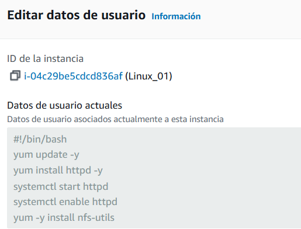
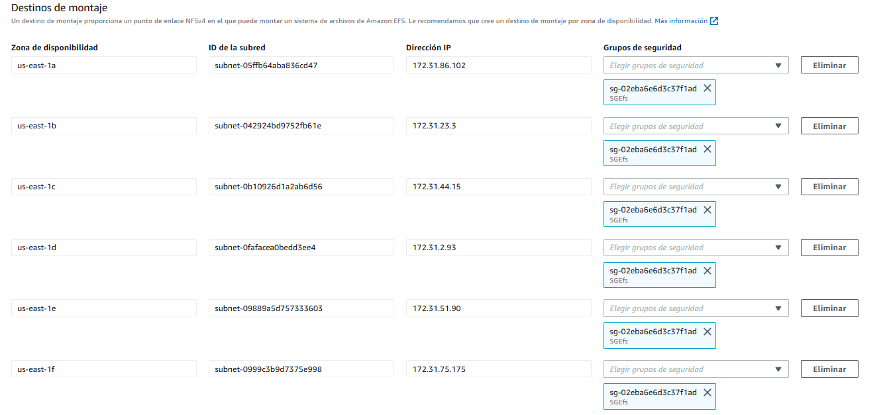

## Gestión de Bases de Datos
Repositorio para prácticas de Base de Datos

## Práctica 4.3: Despliegue de una arquitectura EFS-EC2-MultiAZ

### Creación de Grupos de Seguridad

Para esta práctica primero en el servicio EC2, iremos a Grupos de Seguridad y creamos 2 grupos de seguridad, en uno lo llamaremos SGweb y abriremos el purto 80, HTTP desde cualquier IPv4 y el puerto 22 de SSH por si hay que modificarlo, el otro se llamará SGEfs con el puerto 2049 de NFS para cualquier IPv4.

### Creación de Instancias EC2

Seguimos en el servicio EC2 y ahora creamos una EC2 que se llamará Linux_01, con Amazon Linux, par de claves vockey, la VPC predeterminada pero elegimos la subred a, y permitimos que asigne una ip pública, se le asigna el grupo de seguridad que antes hemos creado con el nombre Sgweb. En configuración avanzada introducimos los datos de usuario que se muestran a continuación:

#!/bin/bash

yum update -y

yum install httpd -y

systemctl start httpd

systemctl enable httpd

yum -y install nfs-utils

Y lanzamos la instancia, mientras crearemos otra instancia llamada Linux_02, con la misma configuración Amazon Linux,par de claves vockey, VPC predeterminada pero con subred b y el mismo grupo de seguridad llamado SGweb y volvemos a configuración avanzada para pegar los datos de usuario, por último lanzamos la instancia.

### Creación del Sistema de Archivos

En el servicio EFS, vamos a crear un sistema de ficheros, llamado minfs y tendrá el VPC por defecto y elegimos la opción Estándar para que esté disponible en todas las zonas de disponibilidad.

Entramos en nuestro sistema de ficheros llamado miefs y accederemos a los grupos de seguridad y en todas las subredes le asignaremos el grupo de seguridad SGEfs. 

### Configuración de los servidores web

Cuando se han terminado de crear, conectaremos a ellas donde podemos verificar que se haya instalado correctamente Apache y después de verificar entraremos en /var/www/html y crearemos una carpeta llamada efs-mount con el comando “mkdir efs-mount”.

Ahora vamos a utilizar el comando para montar en un sistema nfs sobre la carpeta que hemos creado, y ejecutamos el comando cambiando el id marcado en azul por el nuestro.
“sudo mount -t nfs -o nfsvers=4.1,rsize=1048576,wsize=1048576,hard,timeo=600,retrans=2,noresvport fs-09d8395cbf7d9bf1c.efs.us-east-1.amazonaws.com:/ efs-mount”.

Ahora con otro comando nos descargaremos la página web:
“wget https://s3.eu-west-1.amazonaws.com/www.profesantos.cloud/Netflix.zip”, lo descomprimimos con el comando “unzip Netflix.zip” y ya estaría la página web.

Estos pasos también la hacemos en la segunda máquina EC2 para así que se vea la misma página web en los dos servidores. Si buscamos nuestra ip en internet y en la ruta accedemos al html de la página web se visualizará, ahora vamos a modificar el archivo de Apache para simplemente acceder a la página con nuestra ip.
