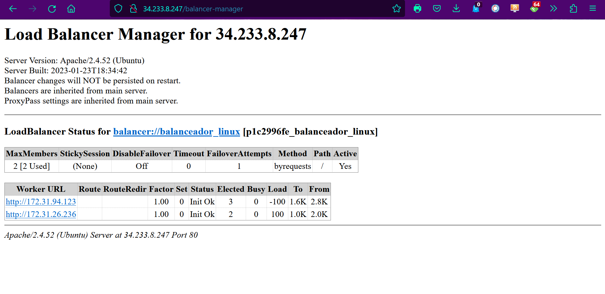

## Práctica 4.3: Despliegue de una arquitectura EFS-EC2-MultiAZ

## Explicación del despliegue

Crearemos en el servicio EFS un sistema de ficheros que será un sistema distribuido con un sistema NFS por el protocolo NFS y puerto 2049. Tendrá un grupo de seguridad con el puerto 2049 abierto y que solo puedan acceder las máquinas EC2 con apache para securizar todo.

Se sumará a esto una máquina EC2, que tenga instalado Apache en la zona 1a y otra máquina EC2, que tenga instalado Apache en la zona 1b, que ambas configuradas para que sepan leer de la estructura de ficheros EFS, y con el puerto 22 y 80 abierto.

Con esto tendremos una página web estática de alta disponibilidad y Multi A-Z, por si se nos cae la zona de disponibilidad 1a trabajaría con la 1b y al contrario.

Además le añadiremos un balanceador de carga que será creado con una EC2 y se conectará a los servidores web para que distribuya automáticamente el tráfico.

Por último creamos una RDS que recopile los datos que se recopilen del formulario de los servidores con el puerto 3306 abierto para que solo puedan acceder las máquinas del grupo de seguridad SGWeb.

Con esto ya estaría listo nuestro despliegue con su balanceador de carga que distribuya el tráfico de la red a los dos servidores web que hemos levantado, que están en diferentes zonas de disponibilidad, en la a y b, con apache instalado y operando, en estos servidores guardamos nuestra página web.
También tenemos un sistema de ficheros para que administre nuestros archivos en ambos servidores y si un servidor se cae que tenga la misma información que el otro.
Y además tendrá una RDS conectada a las máquinas del grupos de seguridad web que guarde los datos introducidos por los servidores que acederá unicamente el balanceador.

Tendremos una arquitectura en la nube con una alta disponibilidad, ya que cayendose un servidor todo seguiría funcionando por el otro, con alta escalabilidad ya que se podrían implementar facilmente más nodos, e incluso otras máquinas, con alta seguridad ya que hemos securizado los puertos para que solo accedan a los servidores web desde el balanceador y la base de datos solo accesible desde las instancias del grupo de seguridad web y con un alto rendimiento.

## Creación del despliegue
### Creación de Grupos de Seguridad

Para esta práctica primero en el servicio EC2, iremos a Grupos de Seguridad y creamos 2 grupos de seguridad, en uno lo llamaremos SGweb y abriremos el purto 80, HTTP desde cualquier IPv4 y el puerto 22 de SSH por si hay que modificarlo, el otro se llamará SGEfs con el puerto 2049 de NFS para cualquier IPv4. Quedando así:

### Creación de Instancias EC2

Seguimos en el servicio EC2 y ahora creamos una EC2 que se llamará Linux_01, con Amazon Linux, par de claves vockey, la VPC predeterminada pero elegimos la subred a, y permitimos que asigne una ip pública, se le asigna el grupo de seguridad que antes hemos creado con el nombre Sgweb. 

En configuración avanzada introducimos los datos de usuario que se muestran a continuación:

    #!/bin/bash
    yum update -y
    yum install httpd -y
    systemctl start httpd
    systemctl enable httpd
    yum -y install nfs-utils

Y lanzamos la instancia, mientras crearemos otra instancia llamada Linux_02, con la misma configuración Amazon Linux,par de claves vockey, VPC predeterminada pero con subred b y el mismo grupo de seguridad llamado SGweb y volvemos a configuración avanzada para pegar los datos de usuario, por último lanzamos la instancia.

Además creamos un par de ips elásticas para que al cerrar el laboratorio, esta no cambie, las creamos y las asociamos una por máquina.

### Creación del Sistema de Archivos

En el servicio EFS, vamos a crear un sistema de ficheros, llamado minfs y tendrá el VPC por defecto y elegimos la opción Estándar para que esté disponible en todas las zonas de disponibilidad.

Entramos en nuestro sistema de ficheros llamado miefs y accederemos a los grupos de seguridad y en todas las subredes le asignaremos el grupo de seguridad SGEfs. 

### Configuración de los servidores web

Cuando se han terminado de crear, conectaremos a ellas donde podemos verificar que se haya instalado correctamente Apache y después de verificar entraremos en /var/www/html y crearemos una carpeta llamada efs-mount con el comando “mkdir efs-mount”.

Ahora vamos a utilizar el comando para montar en un sistema nfs sobre la carpeta que hemos creado, y ejecutamos el comando cambiando el id por el nuestro.
“sudo mount -t nfs -o nfsvers=4.1,rsize=1048576,wsize=1048576,hard,timeo=600,retrans=2,noresvport fs-0b3af357a01238bb9.efs.us-east-1.amazonaws.com:/ efs-mount”.

Ahora con otro comando nos descargaremos la página web:
“wget https://s3.eu-west-1.amazonaws.com/www.profesantos.cloud/Netflix.zip”, lo descomprimimos con el comando “unzip Netflix.zip” y ya estaría la página web.

Estos pasos también la hacemos en la segunda máquina EC2 para así que se vea la misma página web en los dos servidores. Si buscamos nuestra ip en internet y en la ruta accedemos al html de la página web se visualizará.

Ahora vamos a modificar el archivo de Apache para simplemente acceder a la página con nuestra ip.

Así que modificaremos el archivo /etc/httpd/conf/httpd.conf con “sudo nano” o “vim” y modificaremos el DocumentRoot a DocumentRoot "/var/www/html/efs-mount", y después reiniciaremos el servicio httpd con “systemctl restart httpd”, esto se hará en los dos servidores.

Con esto ya estaría los servidores web configurados y si ponemos simplemente la ip de los servidores nos mostrará la página web.

### Creación del balanceador

Creamos otra EC2 más para hacer nuestro balanceador, se llamará Balanceador_Linux, con sistema Ubuntu, con par de claves vockey y le creamos un nuevo grupo de seguridad, donde abriremos los puertos SSH,HTTP y HTTPS.
También le asignaremos una ip elástica como a los nodos y se la asociaremos.

Cuando se cree el balanceador, nos conectaremos a él e instalaremos Apache con "sudo apt install apache2", también debemos reiniciar el servicio con el comando "sudo systemctl restart apache2".

A continuación, editamos el fichero /etc/apache2/sites-enabled/000-default.conf para configurar nuestro gestor de balanceo y pondremos lo siguiente:

    ProxyPass /balancer-manager !

    <Proxy balancer://Balanceador_Linux>
        # Server 1
        BalancerMember http://172.31.94.123

        # Server 2
        BalancerMember http://172.31.26.236
    </Proxy>
        ProxyPass / balancer:/Balanceador_Linux/
        ProxyPassReverse / balancer:/Balanceador_Linux/

    <Location /balancer-manager>
        SetHandler balancer-manager
        Order Deny,Allow
        Allow from all
    </Location>

Tras esto reiniciaremos Apache de nuevo con "sudo systemctl restart apache2" y al buscar la ip de nuestro balanceador saldrá la página web, si ponemos a continuacion de la ip "/balancer-manager" se nos mostrará el balanceador.

Con esto el balanceador funciona y si en algún momento se cae un nodo, el otro seguiría mostrando la página web.

### Creación de los ficheros necesarios

#### Fichero index.html
Tendremos que añadir al fichero que descargamos y descomprimimos un botón que nos lleve a introducir los datos para que se guarden en la base de datos, además de un párrafo para introducir nuestro nombre quedando así:

    <!DOCTYPE html>
    <html lang="en">
    <head>
        <meta charset="UTF-8" />
        <meta name="viewport" content="width=device-width, initial-scale=1.0" />
        <link rel="stylesheet" href="style.css" />
        <title>Movie App</title>
    </head>
    <body>
        <header>
            
Guadalupe Luna Velázquez

            <form id="form">
                <input type="text" id="search" class="search" placeholder="Search">
            </form>
        </header>
            <form action="formulario.php">
                <input class="boton_personalizado" type="submit" value="Donativos Turquia y Siria " />
            </form>
        <main id="main"></main>

        
    </body>
    </html>

#### Fichero style.css

Al fichero que nos descargamos le añadiremos unas regla para el botón de donativos, que son:

    .form {
    width: 100%;
    max-width: 600px;
    margin: 0 auto;
    display: flex;
    flex-direction: column;
    justify-content: center;
    align-items: center;
    }

    .form input {
    width: 90%;
    height: 30px;
    margin: 0.5rem;
    }

    .form button {
    padding: 0.5em 1em;
    border: none;
    background: rgb(100, 200, 255);
    cursor: pointer;
    }

    .center {
    margin: auto;
    width: 50%;
    border: 3px solid green;
    padding: 10px;
    }

    .boton_personalizado{
    text-decoration: none;
    padding: 10px;
    font-weight: 600;
    font-size: 20px;
    color: #ffffff;
    background-color: transparent;
    border-radius: 0px;
    border: 2px solid #EDD8D8;
    }

    .boton_personalizado:hover{
    color: #EDD8D8;
    background-color: transparent;
    }

#### Fichero conexion.php

Crearemos el fichero conexion.php con "sudo nano conexion.php" y pondremos lo siguiente:

    <?php
    $servername = "Punto de enlace de la RDS";
    $username = "admin";
    $password = "Root1234$";
    $bd="Cluster";
    try {
    $conn = new PDO("mysql:host=$servername;dbname=$bd", $username, $password);
    } catch (PDOException $pe) {
    die("Could not connect to the database $dbname :" . $pe->getMessage());
    }

#### Fichero formulario.php

Crearemos el fichero formulario.php con "sudo nano formulario.php" y pondremos lo siguiente:

    <html>
    <head>
        <meta charset="UTF-8" />
        <meta name="viewport" content="width=device-width, initial-scale=1.0" />
        <link rel="stylesheet" href="style.css" />
    </head>
    <body>
        <header>
            <form id="form">
                <input type="text" id="search" class="search" placeholder="Search">
            </form>
        </header>
        <main id="main">
            <form action="grabar.php" method="post" class="form">
            <label ><h1> DONATIVOS PARA TURQUIA Y SIRIA </h1></label>
            <label for="name">Nombre :</label>
            <input type="text" id="nombre" name="nombre">
             
            Amelia Pérez Flores
            10:54
            <label for="donativo">Donativo: </label>
            <input type="donativo" id="donativo" name="donativo">
             
            <input type="radio" name="tipomoneda" value="euro" checked > Euros  
            <input type="radio" name="tipomoneda" value="dolar"> Dolares  
             
            <input type="submit" value ="Enviar" name="enviar" />
            </form>

    </body>
    </html>

#### Fichero grabar.php

Crearemos por último el fichero grabar.php con "sudo nano grabar.php" y pondremos lo siguiente:

    <html>
    <head>
        <meta charset="UTF-8" />
        <meta name="viewport" content="width=device-width, initial-scale=1.0" />
        <link rel="stylesheet" href="style.css" />
    </head>
    <body>
        <header>
            <form id="form">
                <input type="text" id="search" class="search" placeholder="Search">
            </form>
        </header>
        <main id="main">
            <?php
            include ('conexion.php');
            $nombre=$_REQUEST['nombre'];
            $donativo=$_REQUEST['donativo'];
            $tipomoneda=$_REQUEST['tipomoneda'];
            $data = [
                'nombre' => $nombre,
                'donativo' => $donativo,
                'tipomoneda' => $tipomoneda,
            ];
            $sql = "INSERT INTO donativos VALUES (null,:nombre, :donativo, :tipomoneda)";
            $stmt= $conn->prepare($sql);
            $stmt->execute($data);
            echo "
";
            echo "<h2> Has colaborado con ". $donativo. "  " . $tipomoneda."</h2>" ;
            echo "<h2> Donacion registrada correctamente. Gracias por su colaboracion </h2>";
            echo "<h2><a href='index.html' > Volver a Inicio </a></h2>";
            echo "
";
            echo "
";
            $sql = 'SELECT sum(donativo) as total from donativos;';
                foreach ($conn->query($sql) as $row) {
                    echo "TOTAL RECAUDADO ".$row['total'] . "\n";
                }
            echo "
";
            ?>
        </main>
    </body>
    </html>

Quedando los ficheros así, menos el grabar.php.save, que serán los datos guardados del grabar.php y tampoco prueba.php.

### Creación de la base de datos

Ahora nos toca ir al servicio RDS y crear una nueva RDS, elegiremos una Creación estándar con Mysql, en la capa de Producción, en Disponibilidad y durabilidad escogeremos Instancia de base de datos Multi-AZ, después le daremos nombre a nuestra RDS que será cluster y la contraseña maestra que será Root1234$, en Configuración de la instancia elegiremos Clases con ráfagas (incluye clases t). Además en almacenamiento, ya que no vamos a llenarla mucho pondremos los umbrales mínimos de almacenamiento.

Después le daremos acceso público y crearemos un grupo de seguridad solo para esta máquina, llamado SGMyql que tendrá el puerto 3306 abierto a cualquier ip, ya con esto creamos la máquina.

Cuando se acabe de crear esta máquina y esté disponible, abriremos HeidiSQL y crearemos una nueva conexión con los parámetros de esta RDS recién creada.

Cuando ya tenemos la página de consulta abierta escribiremos el código para crear la base de datos que guarde la información de nuestra página web donde hemos introducido un link para hacer donativos. El script para crear la base de datos es:

    CREATE DATABASE Cluster;
    USE Cluster;

    CREATE TABLE donativos ( 
    id INT(5) PRIMARY KEY AUTO_INCREMENT, 
    nombre VARCHAR(30), 
    donativo DECIMAL(8,2),
    tipomoneda CHAR(5) CHECK (tipomoneda IN ('Euro','Dolar')));

Lo ejecutamos y si no dan fallos ya tendremos la parte de la base de datos, pero tendremos que modificar el fichero conexion.php para introducir nuestros parámetros.

### Comprobación del despliegue

Ahora que todo esta configurado, vamos a comprobar que funciona todo perfectamente, iremos a la ip del balanceador y al ponerla en internet nos saldrá nuestra página web.

Iremos al enlace de donativos Turquía y Siria y nos aparecerá el formulario el cual rellenaremos con los datos que se nos pide y lo enviaremos.

Cuando le hayamos dado a enviar, nos aparecerá un mensaje que diga que la donación se ha hecho correctamente y lo total recaudado.

Con esto el funcionamiento de todo el despliegue estaría correcto.

### Securización de los puertos

Por último, debemos proteger y securizar todo el despliegue, en el grupo de seguridad de los nodos que contienen la página Web (SGWeb), debemos de cambiar securizar el puerto 80 para que solo se puedan acceder por el balanceador y no estén expuestos al público, poniendolo accesible solo desde la ip del balanceador.

En el grupo e seguridad del balanceador, el puerto 80 sí será accesible desde cualquier ip para que todo el mundo pueda ver la página web y donar y podremos tener el puerto 22 abierto para configurar más cosas o no.

En el grupo de seguridad de la RDS, llamado SGMysql, tendremos que cambiar para que el puerto 3306 solo sea accesible desde todas las máquinas que pertenezcan al grupo de seguridad web (SGWeb).

En la base de datos también deberemos de quitar el acceso público.

Aun modificando esto nuestra página web se verá igual de bien y no será tan fácilmente accesible.
